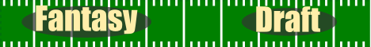
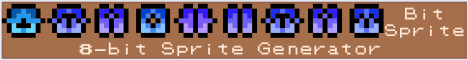
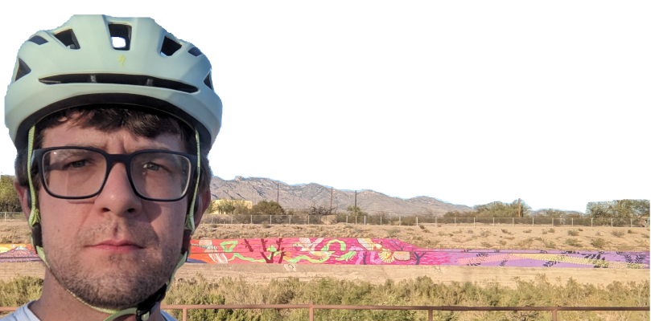

# <picture>
  <source media="(prefers-color-scheme: dark)" srcset="./assets/obligatory-web-dev.svg">
  <source media="(prefers-color-scheme: light)" srcset="./assets/obligatory-web-dev-light.svg">
  
</picture>

> [!IMPORTANT]
> I'm a pretty big deal
> 

### ☀️⛰️🌵🌵🌵 I am a full stack web developer living in Tucson, Arizona! 🌵🌵🌵⛰️☀️

| Genre | Skill    |  Notes                            | 
|-------|-------|-------------------------------------------|
| WORK     | |
| | Python   | Every time I need to do something with a csv |
| | Go | if err != nil {bad times} |
| | JavaScript | WASM will be replacing JS devs any day now - 2016 |
| | CSS      | I usually remember to remove magenta borders |
| | React    | Joyfully participating in the class vs. hook cycle  |
| | Docker   | Deprived myself of the excuse "It works on my computer".  Mostly. | 
| | Git | I push, I pull, I usually explain why |
| PLAY | |
| | Cycling | Any given day I outpace or at least draw my demons |
| | Movies | Given enough time, I will explain Billy Jack to you. In painful detail. |
| | Partying |   |

When not gainfully employed, I like to vandalize my github profile, start projects and occasionally even finish them.

## Some of my favorite personal projects:

### A fun portfolio website built back in 2022:

### A Fantasy Football League prototype:

### An interesting tool to generate small procedural spritesheets:

# Stay Hydrated and Wear a Helmet!

